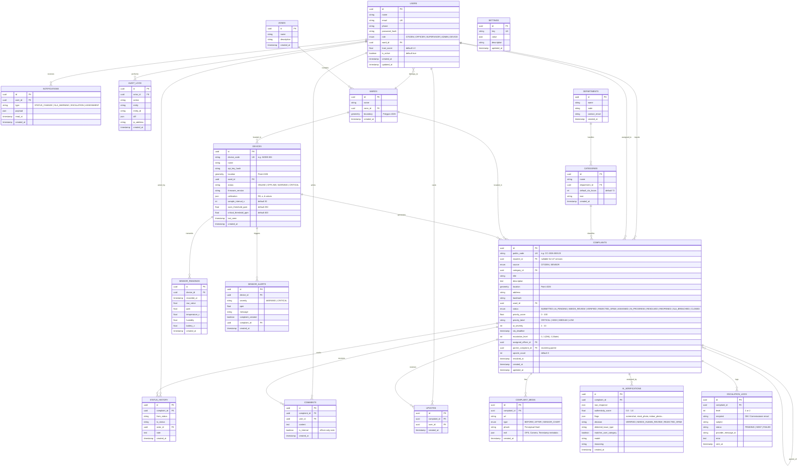

# CityClean Entity Relationship (ER) Diagram

```mermaid
erDiagram
    USERS ||--o{ COMPLAINTS : "reports"
    USERS ||--o{ COMPLAINTS : "assigned_to"
    USERS ||--o{ STATUS_HISTORY : "acted_by"
    USERS ||--o{ COMMENTS : "writes"
    USERS ||--o{ UPVOTES : "casts"
    USERS ||--o{ NOTIFICATIONS : "receives"
    USERS ||--o{ AUDIT_LOGS : "performs"
    USERS }o--|| WARDS : "belongs_to"

    ZONES ||--o{ WARDS : "contains"
    DEPARTMENTS ||--o{ CATEGORIES : "handles"
    CATEGORIES ||--o{ COMPLAINTS : "classifies"

    WARDS ||--o{ COMPLAINTS : "located_in"
    WARDS ||--o{ DEVICES : "located_in"

    COMPLAINTS ||--o{ COMPLAINT_MEDIA : "has"
    COMPLAINTS ||--o{ AI_VERIFICATIONS : "analyzed_by"
    COMPLAINTS ||--o{ STATUS_HISTORY : "tracks"
    COMPLAINTS ||--o{ COMMENTS : "receives"
    COMPLAINTS ||--o{ UPVOTES : "receives"
    COMPLAINTS ||--o{ ESCALATION_LOGS : "logs"
    COMPLAINTS ||--o{ COMPLAINTS : "parent_of"

    DEVICES ||--o{ SENSOR_READINGS : "transmits"
    DEVICES ||--o{ SENSOR_ALERTS : "triggers"
    DEVICES ||--o{ COMPLAINTS : "generates"

    USERS {
        uuid id PK
        string name
        string email UK
        string phone
        string password_hash
        enum role "CITIZEN | OFFICER | SUPERVISOR | ADMIN | DEVICE"
        uuid ward_id FK
        float trust_score "default 1.0"
        boolean is_active "default true"
        timestamp created_at
        timestamp updated_at
    }

    ZONES {
        uuid id PK
        string name
        string description
        timestamp created_at
    }

    WARDS {
        uuid id PK
        string name
        uuid zone_id FK
        geometry boundary "Polygon 4326"
        timestamp created_at
    }

    DEPARTMENTS {
        uuid id PK
        string name
        string code
        string contact_email
        timestamp created_at
    }

    CATEGORIES {
        uuid id PK
        string name
        uuid department_id FK
        int default_sla_hours "default 72"
        string icon
        timestamp created_at
    }

    COMPLAINTS {
        uuid id PK
        string public_code UK "e.g. CC-2026-000123"
        uuid reporter_id FK "nullable for IoT sensors"
        enum source "CITIZEN | SENSOR"
        uuid category_id FK
        string title
        text description
        geometry location "Point 4326"
        string address
        string landmark
        uuid ward_id FK
        enum status "SUBMITTED | AI_PENDING | NEEDS_REVIEW | VERIFIED | REJECTED_SPAM | ASSIGNED | IN_PROGRESS | RESOLVED | REOPENED | SLA_BREACHED | CLOSED"
        float priority_score "0 - 100"
        string priority_label "CRITICAL | HIGH | MEDIUM | LOW"
        int ai_severity "1 - 10"
        timestamp sla_deadline
        int escalation_level "0, 1 (DM), 2 (State)"
        uuid assigned_officer_id FK
        uuid parent_complaint_id FK "clustering parent"
        int upvote_count "default 0"
        timestamp resolved_at
        timestamp created_at
        timestamp updated_at
    }

    COMPLAINT_MEDIA {
        uuid id PK
        uuid complaint_id FK
        string url
        enum type "BEFORE | AFTER | SENSOR_CHART"
        string phash "Perceptual Hash"
        json exif "GPS, Camera, Timestamp metadata"
        timestamp created_at
    }

    AI_VERIFICATIONS {
        uuid id PK
        uuid complaint_id FK
        json raw_response
        float authenticity_score "0.0 - 1.0"
        json flags "screenshot, stock_photo, indoor_photo..."
        string decision "VERIFIED | NEEDS_HUMAN_REVIEW | REJECTED_SPAM"
        string detected_issue_type
        boolean matches_user_category
        string model
        string reasoning
        timestamp created_at
    }

    STATUS_HISTORY {
        uuid id PK
        uuid complaint_id FK
        string from_status
        string to_status
        uuid actor_id FK
        text note
        timestamp created_at
    }

    COMMENTS {
        uuid id PK
        uuid complaint_id FK
        uuid user_id FK
        text content
        boolean is_internal "officer-only note"
        timestamp created_at
    }

    UPVOTES {
        uuid id PK
        uuid complaint_id FK
        uuid user_id FK
        timestamp created_at
    }

    ESCALATION_LOGS {
        uuid id PK
        uuid complaint_id FK
        int level "1 or 2"
        string recipient "DM / Commissioner email"
        string subject
        string status "PENDING | SENT | FAILED"
        string provider_message_id
        text error
        timestamp sent_at
    }

    NOTIFICATIONS {
        uuid id PK
        uuid user_id FK
        string type "STATUS_CHANGE | SLA_WARNING | ESCALATION | ASSIGNMENT"
        json payload
        timestamp read_at
        timestamp created_at
    }

    DEVICES {
        uuid id PK
        string device_code UK "e.g. NODE-001"
        string name
        string api_key_hash
        geometry location "Point 4326"
        uuid ward_id FK
        string status "ONLINE | OFFLINE | WARNING | CRITICAL"
        string firmware_version
        json calibration "R0, a, b values"
        int sample_interval_s "default 30"
        float warn_threshold_ppm "default 250"
        float critical_threshold_ppm "default 400"
        timestamp last_seen
        timestamp created_at
    }

    SENSOR_READINGS {
        uuid id PK
        uuid device_id FK
        timestamp recorded_at
        float raw_value
        float ppm
        float temperature_c
        float humidity
        float battery_v
        timestamp created_at
    }

    SENSOR_ALERTS {
        uuid id PK
        uuid device_id FK
        string severity "WARNING | CRITICAL"
        float ppm
        string message
        boolean complaint_created
        uuid complaint_id FK
        timestamp created_at
    }

    SETTINGS {
        uuid id PK
        string key UK
        json value
        string description
        timestamp updated_at
    }

    AUDIT_LOGS {
        uuid id PK
        uuid actor_id FK
        string action
        string entity
        string entity_id
        json diff
        string ip_address
        timestamp created_at
    }
```
